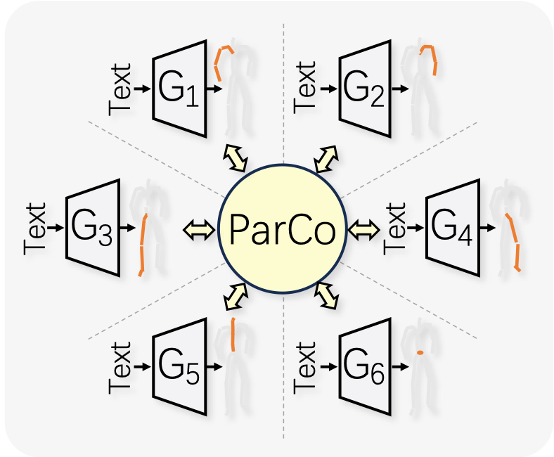
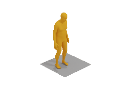
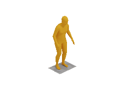
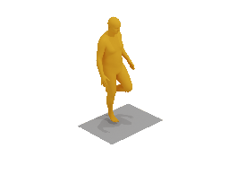
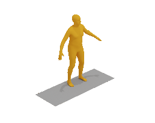
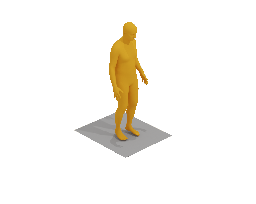

# ParCo: Part-Coordinating Text-to-Motion Synthesis

<p align="center">
  
</p>

Pytorch implementation of paper [ParCo: Part-Coordinating Text-to-Motion Synthesis](https://arxiv.org/abs/2403.18512) [ECCV 2024].

[](https://arxiv.org/abs/2403.18512)
[](./docs/README_zh.md)
[](https://colab.research.google.com/drive/1mGYpqIoB7BWgvfm7xxTZ4bUYPaeBRn2D?usp=sharing)

<p align="center">
<table>

  <tr>
    <th colspan="4">Text: "a person is having a hearty laugh and makes a jovial motion with their left hand."</th>
  </tr>
  <tr>
    <th>🔥ParCo (Ours)🔥</th>
    <th><u><a href="https://mingyuan-zhang.github.io/projects/ReMoDiffuse.html"><nobr>ReMoDiffuse</nobr> </a></u></th>
    <th><u><a href="https://mael-zys.github.io/T2M-GPT/"><nobr>T2M-GPT</nobr> </a></u></th>
    <th><u><a href="https://mingyuan-zhang.github.io/projects/MotionDiffuse.html"><nobr>MotionDiffuse</nobr> </a></u></th>
  </tr>
  <tr>
    <td></td>
    <td></td>
    <td></td>
    <td></td>
  </tr>


  <tr>
    <th colspan="4">Text: "standing on one leg and hopping."</th>
  </tr>
  <tr>
    <th>🔥ParCo (Ours)🔥</th>
    <th><u><a href="https://mingyuan-zhang.github.io/projects/ReMoDiffuse.html"><nobr>ReMoDiffuse</nobr> </a></u></th>
    <th><u><a href="https://mael-zys.github.io/T2M-GPT/"><nobr>T2M-GPT</nobr> </a></u></th>
    <th><u><a href="https://mingyuan-zhang.github.io/projects/MotionDiffuse.html"><nobr>MotionDiffuse</nobr> </a></u></th>
  </tr>
  <tr>
    <td></td>
    <td></td>
    <td></td>
    <td></td>
  </tr>


  <tr>
    <th colspan="4">Text: "a man steps back, picks something up and put it to his head and then puts it back."</th>
  </tr>
  <tr>
    <th>🔥ParCo (Ours)🔥</th>
    <th><u><a href="https://mingyuan-zhang.github.io/projects/ReMoDiffuse.html"><nobr>ReMoDiffuse</nobr> </a></u></th>
    <th><u><a href="https://mael-zys.github.io/T2M-GPT/"><nobr>T2M-GPT</nobr> </a></u></th>
    <th><u><a href="https://mingyuan-zhang.github.io/projects/MotionDiffuse.html"><nobr>MotionDiffuse</nobr> </a></u></th>
  </tr>
  <tr>
    <td></td>
    <td></td>
    <td></td>
    <td></td>
  </tr>


</table>
</p>


If our project is helpful for your research, please consider **starring** this repo and **citing** our paper:
```
@article{zou2024parco,
  title={ParCo: Part-Coordinating Text-to-Motion Synthesis},
  author={Zou, Qiran and Yuan, Shangyuan and Du, Shian and Wang, Yu and Liu, Chang and Xu, Yi and Chen, Jie and Ji, Xiangyang},
  journal={arXiv preprint arXiv:2403.18512},
  year={2024}
}
```

## Computational resource consumption 

### Training
Time and GPU memory consumed for training (single A100 GPU):

|        | (Stage-1) VQ-VAE | (Stage-2) Part-Coordinated Transformer |
|:-------|:----------------:|:--------------------------------------:|
| Time   |      20.5h       |                 52.3h                  |
| Memory |      3.5GB       |                 28.4GB                 |


### Inference


| Method       | Param(M) | FLOPs(G) | InferTime(s) |
|:-------------|:--------:|:--------:|:------------:|
| ReMoDiffuse  |  198.2   |  481.0   |    0.091     |
| T2M-GPT      |  237.6   |  292.3   |    0.544     |
| ParCo (Ours) |  168.4   |  211.7   |    0.036     |

- For the FLOPs metric, we calculate the FLOPs when the model generates a single motion sample of 200 frames.
- We report the time consumed to generate a single sample for the InferTime metric. 
  We generated 10,000 samples and calculated the average inference time per sample. 
  For ReMoDiff and our ParCo, we set the batch size to 100 (T2M-GPT does not support batch parallel inference).


## Table of Content

- [1. Quick Start Demo](#1-quick-start-demo)
- [2. Installation](#2-installation)
- [3. Train ParCo](#3-train-parco)
- [4. Evaluation](#4-evaluation)
- [5. Pre-trained Models](#5-pre-trained-models)
- [6. ParCo with up&low body partition](#6-parco-with-uplow-body-partition)
- [7. Visualize Motion](#7-visualize-motion)
- [TODO](#todo)
- [Acknowledgement](#acknowledgement)


## 1. Quick Start Demo

### 1.1. Colab Demo

👉 Try our [Colab demo](https://colab.research.google.com/drive/1mGYpqIoB7BWgvfm7xxTZ4bUYPaeBRn2D?usp=sharing) !

Our demo shows how to prepare the environment and inference with ParCo.
You can also conveniently explore our ParCo.

If you wish to reproduce the visualization results of ParCo, 
we recommend installing the environment locally following our tutorial and reproducing it there 
(as results differ between Colab and local runs). 
This is likely due to differences in GPU and CUDA environment between Colab and local training/testing.

<p align="center">

</p>

### 1.2. Local Quick Inference

After the installation completed, 
you can directly generate motion (.gif format) with your own text input as following:

```
CUDA_VISIBLE_DEVICES=0 python visualize/infer_motion_npy.py \
--eval-exp-dir output/ParCo_official_HumanML3D/VQVAE-ParCo-t2m-default/00000-Trans-ParCo-default \
--select-ckpt fid \
--infer-mode userinput \
--input-text 'an idol trainee is dancing like a basketball dribbling.' \
--skip-path-check
```
The generated motion visual sample is saved as `output/visualize/XXXXX-userinput/skeleton_viz.gif`.

<p align="center">

</p>

## 2. Installation

### 2.1. Environment

Our model was trained and tested on a single A100-40G GPU
with software environment: Python 3.7.11, PyTorch 1.10.1, CUDA 11.3.1, cuDNN 8.2.0, Ubuntu 20.04.

- CUDA & cuDNN (cuDNN may not be necessary)

    CUDA and cuDNN should be installed first. We use following version:
    `CUDA: 11.3.1` and `cuDNN: 8.2.0`.

  - Install CUDA 11.3:
    1. Download from [here](https://developer.nvidia.com/cuda-11-3-1-download-archive)
       (we recommend to choose installer type as `runfile (local)`.
    1. Install the runfile using the scripts given by the official website.
    1. Before running our code, check if your CUDA environment is linked to CUDA 11.3 (run `nvcc --version` to check). 
    If the version is not 11.3, you need to add the CUDA path into your environment by `export PATH=/usr/local/cuda-11.3/bin:$PATH`,
    then check the version again.
    
  - Install cuDNN 8.2.0:
    1. Download from [here](https://developer.nvidia.com/rdp/cudnn-archive) (select `8.2.0 for CUDA 11.X` and `cuDNN Library for Linux/Windows` according to your system)
    1. Install the cuDNN according to this [guide](https://docs.nvidia.com/deeplearning/cudnn/archives/cudnn-820/install-guide/index.html#installlinux-tar).
    Refer to Section `2.3.1. Tar File Installation` since we download tar file at previous stage.


- Conda environment
  
  You need to following these scripts below to avoid potential package conflicts. 
  Otherwise, it may be unable to install PyTorch properly or fail to install some packages.

  - Create conda environment
    ```
    conda create -n ParCo blas=1.0 bzip2=1.0.8 ca-certificates=2021.7.5 certifi=2021.5.30 freetype=2.10.4 gmp=6.2.1 gnutls=3.6.15 intel-openmp=2021.3.0 jpeg=9b lame=3.100 lcms2=2.12 ld_impl_linux-64=2.35.1 libffi=3.3 libgcc-ng=9.3.0 libgomp=9.3.0 libiconv=1.15 libidn2=2.3.2 libpng=1.6.37 libstdcxx-ng=9.3.0 libtasn1=4.16.0 libtiff=4.2.0 libunistring=0.9.10 libuv=1.40.0 libwebp-base=1.2.0 lz4-c=1.9.3 mkl=2021.3.0 mkl-service=2.4.0 mkl_fft=1.3.0 mkl_random=1.2.2 ncurses=6.2 nettle=3.7.3 ninja=1.10.2 numpy=1.20.3 numpy-base=1.20.3 olefile=0.46 openh264=2.1.0 openjpeg=2.3.0 openssl=1.1.1k pillow=8.3.1 pip=21.0.1 readline=8.1 setuptools=52.0.0 six=1.16.0 sqlite=3.36.0 tk=8.6.10 typing_extensions=3.10.0.0 wheel=0.37.0 xz=5.2.5 zlib=1.2.11 zstd=1.4.9 python=3.7
    ```
    ```
    conda activate ParCo
    ```
  - Install essential packages (execute all scripts below)
    ```
    conda install ffmpeg=4.3 -c pytorch
    conda install pytorch==1.10.1 torchvision==0.11.2 torchaudio==0.10.1 cudatoolkit=11.3 -c pytorch -c conda-forge
    ```
    ``` 
    pip install absl-py==0.13.0 backcall==0.2.0 cachetools==4.2.2 charset-normalizer==2.0.4 chumpy==0.70 cycler==0.10.0 decorator==5.0.9 google-auth==1.35.0 google-auth-oauthlib==0.4.5 grpcio==1.39.0 idna==3.2 imageio==2.9.0 ipdb==0.13.9 ipython==7.26.0 ipython-genutils==0.2.0 jedi==0.18.0 joblib==1.0.1 kiwisolver==1.3.1 markdown==3.3.4 matplotlib==3.4.3 matplotlib-inline==0.1.2 oauthlib==3.1.1 pandas==1.3.2 parso==0.8.2 pexpect==4.8.0 pickleshare==0.7.5 prompt-toolkit==3.0.20 protobuf==3.17.3 ptyprocess==0.7.0 pyasn1==0.4.8 pyasn1-modules==0.2.8 pygments==2.10.0 pyparsing==2.4.7 python-dateutil==2.8.2 pytz==2021.1 pyyaml==5.4.1 requests==2.26.0 requests-oauthlib==1.3.0 rsa==4.7.2 scikit-learn==0.24.2 scipy==1.7.1 sklearn==0.0 smplx==0.1.28 tensorboard==2.6.0 tensorboard-data-server==0.6.1 tensorboard-plugin-wit==1.8.0 threadpoolctl==2.2.0 toml==0.10.2 tqdm==4.62.2 traitlets==5.0.5 urllib3==1.26.6 wcwidth==0.2.5 werkzeug==2.0.1 git+https://github.com/openai/CLIP.git git+https://github.com/nghorbani/human_body_prior gdown moviepy
    ```
    ```
    pip install imageio-ffmpeg
    pip install importlib-metadata==4.13.0
    ```

  - Install packages for rendering the motion (optional)
    ```
    bash dataset/prepare/download_smpl.sh
    conda install -c menpo osmesa
    conda install h5py
    conda install -c conda-forge shapely pyrender trimesh==3.22.5 mapbox_earcut
    ```
    If you are using proxy to access Google Drive, use `bash dataset/prepare/use_proxy/download_smpl.sh` for downloading.
    Default proxy port in the script is set to `1087`, you can modify it to your own proxy port.

### 2.2. Feature extractors

We use the extractors provided by [T2M](https://github.com/EricGuo5513/text-to-motion) for evaluation.
Please download the extractors and glove word vectorizer. Note that 'zip' should be pre-installed in your system, if not, run
`sudo apt-get install zip` to install zip.
```
bash dataset/prepare/download_glove.sh
bash dataset/prepare/download_extractor.sh
```
If you are using proxy to access Google Drive, use scripts below for downloading.
Default proxy port in the script is set to `1087`, you can modify the scripts to set your own proxy port.
```
bash dataset/prepare/use_proxy/download_glove.sh
bash dataset/prepare/use_proxy/download_extractor.sh
```

### 2.3. Datasets

Two 3D human motion-language datasets, [HumanML3D](https://github.com/EricGuo5513/HumanML3D) and [KIT-ML](https://arxiv.org/pdf/1607.03827.pdf), are used by our project. 
You can find preparation and acquisition for both datasets [[here]](https://github.com/EricGuo5513/HumanML3D).

You can also directly download these datasets processed by us: [[Google Drive]](https://drive.google.com/drive/folders/1BuxQWAWtxwauD7AqF0TIpWjoqujYKq8v?usp=share_link).

The file directory should look like:
```
./dataset/HumanML3D/
├── new_joint_vecs/
├── texts/
├── Mean.npy # same as in [HumanML3D](https://github.com/EricGuo5513/HumanML3D) 
├── Std.npy # same as in [HumanML3D](https://github.com/EricGuo5513/HumanML3D) 
├── train.txt
├── val.txt
├── test.txt
├── train_val.txt
└── all.txt
```

## 3. Train ParCo

The experiment directory structure of our project is:
```
./output  (arg.out_dir)
 ├── 00000-DATASET  (exp_number + dataset_name)
 │   └── VQVAE-EXP_NAME-DESC  (VQVAE + args.exp_name + desc)
 │       ├── events.out.XXX
 │       ├── net_best_XXX.pth
 │       ...
 │       ├── run.log
 │       ├── test_vqvae
 │       │   ├── ...
 │       │   ...
 │       ├── 0000-Trans-EXP_NAME-DESC  (stage2_exp_number + Trans + args.exp_name + desc)
 │       │   ├── quantized_dataset  (The quantized motion using VQVAE)
 │       │   ├── events.out.XXX
 │       │   ├── net_best_XXX.pth
 │       │   ...
 │       │   ├── run.log
 │       │   └── test_trans
 │       │       ├── ...
 │       │       ...
 │       ├── 0001-Trans-EXP_NAME-DESC
 │       ...
 ├── 00001-DATASET  (exp_number + dataset_name)
 ...
```


### 3.1. VQ-VAE

For KIT dataset, set `--dataname kit`.

```bash
CUDA_VISIBLE_DEVICES=0 python train_ParCo_vq.py \
--out-dir output \
--exp-name ParCo \
--dataname t2m \
--batch-size 256 \
--lr 2e-4 \
--total-iter 300000 \
--lr-scheduler 200000 \
--vqvae-cfg default \
--down-t 2 \
--depth 3 \
--dilation-growth-rate 3 \
--vq-act relu \
--quantizer ema_reset \
--loss-vel 0.5 \
--recons-loss l1_smooth
```

### 3.2. Part-Coordinated Transformer

Remember to set `--vqvae-train-dir` to the corresponding directory of the VQ-VAE you trained.

For KIT-ML dataset, set `--dataname kit`.

```bash
CUDA_VISIBLE_DEVICES=0 python train_ParCo_trans.py \
--vqvae-train-dir output/00000-t2m-ParCo/VQVAE-ParCo-t2m-default/ \
--select-vqvae-ckpt last \
--exp-name ParCo \
--pkeep 0.4 \
--batch-size 128 \
--trans-cfg default \
--fuse-ver V1_3 \
--alpha 1.0 \
--num-layers 14 \
--embed-dim-gpt 1024 \
--nb-code 512 \
--n-head-gpt 16 \
--block-size 51 \
--ff-rate 4 \
--drop-out-rate 0.1 \
--total-iter 300000 \
--eval-iter 10000 \
--lr-scheduler 150000 \
--lr 0.0001 \
--dataname t2m \
--down-t 2 \
--depth 3 \
--quantizer ema_reset \
--dilation-growth-rate 3 \
--vq-act relu
```


## 4. Evaluation
### 4.1. VQ-VAE

Remember to set `--vqvae-train-dir` to the VQ-VAE you want to evaluate.
```bash
CUDA_VISIBLE_DEVICES=0 python eval_ParCo_vq.py --vqvae-train-dir output/00000-t2m-ParCo/VQVAE-ParCo-t2m-default/ --select-vqvae-ckpt last
```

### 4.2. Part-Coordinated Transformer

For evaluation on KIT-ML dataset, set `--select-ckpt last`.
If you want to evaluate the MultiModality (which takes a long time), just delete `--skip-mmod`.

Remember to set `--eval-exp-dir` to your trained ParCo's directory.
```bash
CUDA_VISIBLE_DEVICES=0 python eval_ParCo_trans.py \
--eval-exp-dir output/00000-t2m-ParCo/VQVAE-ParCo-t2m-default/00000-Trans-ParCo-default \
--select-ckpt fid \
--skip-mmod
```


## 5. Pre-trained Models

Our pretrained models are provided at [[Google Drive]](https://drive.google.com/drive/folders/1MNiA76kChAPVZyhiwHFpOcoqz1mcZIhL?usp=share_link).
Extract the .zip files and put them under `output` folder for evaluation.

You can also run following scripts to prepare the pretrained models:
```bash
mkdir output
cd output
gdown 1jmuX3xDEku3e_ldnTUm192eQRS3EEw99
unzip ParCo_official_model_weights_HumanML3D.zip
cd ..
```

For model trained on KIT-ML, replace the gdown downloading command with `gdown 1_D9vqIhMv5-oz6qfiTGKjsxhS5DNP0PB` 
and unzip command with `unzip ParCo_official_model_weights_KIT-ML.zip`.

Since we renamed the directory of pre-trained models, remember to set `--skip-path-check` when evaluating our Part-Coordinated transformer. For example: 

```bash
CUDA_VISIBLE_DEVICES=0 python eval_ParCo_trans.py \
--eval-exp-dir output/ParCo_official_HumanML3D/VQVAE-ParCo-t2m-default/00000-Trans-ParCo-default \
--select-ckpt fid \
--skip-mmod \
--skip-path-check
```

## 6. ParCo with up&low body partition
Our ParCo adopts 6-part partition strategy.
If you want to investigate ParCo with upper and lower body partition, run the scripts below.
<details>
<summary>
Details
</summary>

- Training (For KIT dataset, set `--dataname kit`):

  - VQ-VAE (Up&Low)
    ```
    CUDA_VISIBLE_DEVICES=0 python utils/ParCo_uplow/train_ParCo_vq_uplow.py \
    --out-dir output \
    --exp-name ParCo \
    --dataname t2m \
    --batch-size 256 \
    --lr 2e-4 \
    --total-iter 300000 \
    --lr-scheduler 200000 \
    --vqvae-cfg default \
    --down-t 2 \
    --depth 3 \
    --dilation-growth-rate 3 \
    --vq-act relu \
    --quantizer ema_reset \
    --loss-vel 0.5 \
    --recons-loss l1_smooth
    ```
    
  - Part-Coordinated Transformer (Up&Low)

    Remember to set `--vqvae-train-dir` to the corresponding directory of the VQ-VAE you trained. 

    ```
    CUDA_VISIBLE_DEVICES=0 python utils/ParCo_uplow/train_ParCo_trans_uplow.py \
    --vqvae-train-dir output/00000-t2m-ParCo-UpLow/VQVAE-ParCo-t2m-default/ \
    --select-vqvae-ckpt last \
    --exp-name ParCo \
    --pkeep 0.4 \
    --batch-size 128 \
    --trans-cfg default \
    --fuse-ver V1_3 \
    --alpha 1.0 \
    --num-layers 14 \
    --embed-dim-gpt 1024 \
    --nb-code 512 \
    --n-head-gpt 16 \
    --block-size 51 \
    --ff-rate 4 \
    --drop-out-rate 0.1 \
    --total-iter 300000 \
    --eval-iter 10000 \
    --lr-scheduler 150000 \
    --lr 0.0001 \
    --dataname t2m \
    --down-t 2 \
    --depth 3 \
    --quantizer ema_reset \
    --dilation-growth-rate 3 \
    --vq-act relu
    ```
    
- Evaluation:

  Similar to the scripts of 6-part, just change the running scripts to the scripts under `utils/ParCo_uplow/` directory.
  For example, to evaluate the Part-Coordinated Transformer (Up&Low), the scripts should be:

  ```
  CUDA_VISIBLE_DEVICES=0 python utils/ParCo_uplow/eval_ParCo_trans_uplow.py \
  --eval-exp-dir output/00000-t2m-ParCo-UpLow/VQVAE-ParCo-t2m-default/00000-Trans-ParCo-default \
  --select-ckpt fid \
  --skip-mmod
  ```
  Remember to set `--eval-exp-dir` to your trained model's directory.
  
</details>


## 7. Visualize Motion

Render SMPL mesh:

- Option-1: Use the tool provided by us (some adopted from [T2M-GPT](https://github.com/Mael-zys/T2M-GPT)):
  1. Generate motions in `.npy` format:
  
     The generated results will be saved under `output/visualize/`. 
  
     Choose your preferred mode:
     - input text by user:
       ```
       CUDA_VISIBLE_DEVICES=0 python visualize/infer_motion_npy.py \
       --eval-exp-dir output/ParCo_official_HumanML3D/VQVAE-ParCo-t2m-default/00000-Trans-ParCo-default \
       --select-ckpt fid \
       --infer-mode userinput \
       --input-text 'an idol trainee is dancing like a basketball dribbling.' \
       --skip-path-check
       ```
     - test set as input:
       ```
       CUDA_VISIBLE_DEVICES=0 python visualize/infer_motion_npy.py \
       --eval-exp-dir output/ParCo_official_HumanML3D/VQVAE-ParCo-t2m-default/00000-Trans-ParCo-default \
       --select-ckpt fid \
       --infer-mode testset \
       --skip-path-check
       ```
  1. Render the `.npy` motion file:
  
     Remember to install the packages for rendering (in 2.1. Environment).
     Set `--filedir` to your own motion file directory. 
     
     The rendered result will be saved at the same directory with your motion file under `rendered_motion` folder.
     For example:
  
     ```
     CUDA_VISIBLE_DEVICES=0 python visualize/render_final.py --filedir output/visualize/00000-userinput/motion.npy 
     ```
     You will get a rendered `.gif` motion. For example:
     <p align="center">
       
     </p>
  

- Option-2 (Recommended): refer to [MLD](https://github.com/chenfengye/motion-latent-diffusion?tab=readme-ov-file).


## TODO
- [x] Add Demo
- [x] Visualization tutorial for rendered motion
- [x] README_zh.md


## Acknowledgement

We thank for:
- Public Codes: 
[T2M-GPT](https://github.com/Mael-zys/T2M-GPT), 
[MLD](https://github.com/chenfengye/motion-latent-diffusion?tab=readme-ov-file),
[MotionDiffuse](https://github.com/mingyuan-zhang/MotionDiffuse), 
[T2M](https://github.com/EricGuo5513/text-to-motion),
[TM2T](https://github.com/EricGuo5513/TM2T), 
[MDM](https://github.com/GuyTevet/motion-diffusion-model),
etc.
- Public Datasets: [HumanML3D](https://github.com/EricGuo5513/HumanML3D) and [KIT-ML](https://arxiv.org/pdf/1607.03827.pdf).

Other awesome public codes from Text-to-Motion community:
[ReMoDiffuse](https://github.com/mingyuan-zhang/ReMoDiffuse), [AttT2M](https://github.com/ZcyMonkey/AttT2M), etc. 


