# ParCo: Part-Coordinating Text-to-Motion Synthesis

<p align="center">
  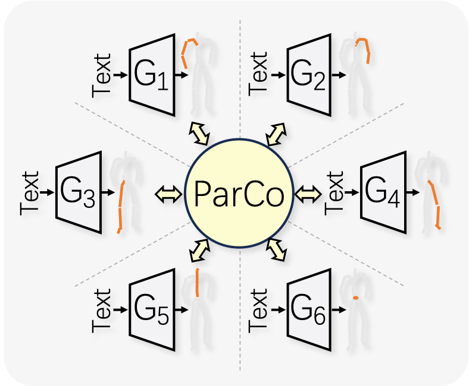
</p>

Pytorch实现论文： [ParCo: Part-Coordinating Text-to-Motion Synthesis](https://arxiv.org/abs/2403.18512)。

[](https://arxiv.org/abs/2403.18512)
[](../README.md)
[](https://colab.research.google.com/drive/1mGYpqIoB7BWgvfm7xxTZ4bUYPaeBRn2D?usp=sharing)

<p align="center">
<table>

  <tr>
    <th colspan="4">文本: "a person is having a hearty laugh and makes a jovial motion with their left hand."</th>
  </tr>
  <tr>
    <th>🔥ParCo (Ours)🔥</th>
    <th><u><a href="https://mingyuan-zhang.github.io/projects/ReMoDiffuse.html"><nobr>ReMoDiffuse</nobr> </a></u></th>
    <th><u><a href="https://mael-zys.github.io/T2M-GPT/"><nobr>T2M-GPT</nobr> </a></u></th>
    <th><u><a href="https://mingyuan-zhang.github.io/projects/MotionDiffuse.html"><nobr>MotionDiffuse</nobr> </a></u></th>
  </tr>
  <tr>
    <td>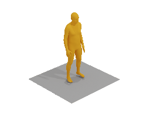</td>
    <td>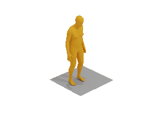</td>
    <td>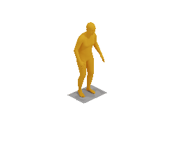</td>
    <td>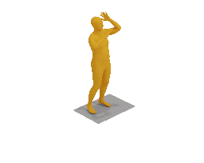</td>
  </tr>


  <tr>
    <th colspan="4">文本: "standing on one leg and hopping."</th>
  </tr>
  <tr>
    <th>🔥ParCo (Ours)🔥</th>
    <th><u><a href="https://mingyuan-zhang.github.io/projects/ReMoDiffuse.html"><nobr>ReMoDiffuse</nobr> </a></u></th>
    <th><u><a href="https://mael-zys.github.io/T2M-GPT/"><nobr>T2M-GPT</nobr> </a></u></th>
    <th><u><a href="https://mingyuan-zhang.github.io/projects/MotionDiffuse.html"><nobr>MotionDiffuse</nobr> </a></u></th>
  </tr>
  <tr>
    <td>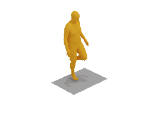</td>
    <td>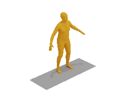</td>
    <td>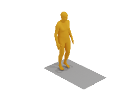</td>
    <td>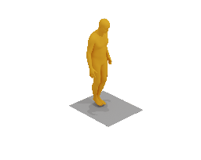</td>
  </tr>


  <tr>
    <th colspan="4">文本: "a man steps back, picks something up and put it to his head and then puts it back."</th>
  </tr>
  <tr>
    <th>🔥ParCo (Ours)🔥</th>
    <th><u><a href="https://mingyuan-zhang.github.io/projects/ReMoDiffuse.html"><nobr>ReMoDiffuse</nobr> </a></u></th>
    <th><u><a href="https://mael-zys.github.io/T2M-GPT/"><nobr>T2M-GPT</nobr> </a></u></th>
    <th><u><a href="https://mingyuan-zhang.github.io/projects/MotionDiffuse.html"><nobr>MotionDiffuse</nobr> </a></u></th>
  </tr>
  <tr>
    <td>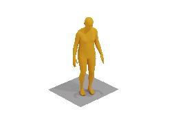</td>
    <td>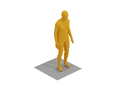</td>
    <td>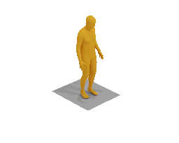</td>
    <td>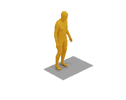</td>
  </tr>


</table>
</p>


如果我们的项目对你的研究有帮助，请考虑给这个仓库**加星**并**引用**我们的论文：
```
@article{zou2024parco,
  title={ParCo: Part-Coordinating Text-to-Motion Synthesis},
  author={Zou, Qiran and Yuan, Shangyuan and Du, Shian and Wang, Yu and Liu, Chang and Xu, Yi and Chen, Jie and Ji, Xiangyang},
  journal={arXiv preprint arXiv:2403.18512},
  year={2024}
}
```

## 计算资源消耗

### 训练
训练所消耗的时间和GPU内存（单个A100 GPU）：

|        | (阶段一) VQ-VAE | (阶段二) Part-Coordinated Transformer |
|:-------|:----------------:|:--------------------------------------:|
| 时间   |      20.5h       |                 52.3h                  |
| 内存   |      3.5GB       |                 28.4GB                 |


### 推理


| 方法       | Param(M) | FLOPs(G) | InferTime(s) |
|:-------------|:--------:|:--------:|:------------:|
| ReMoDiffuse  |  198.2   |  481.0   |    0.091     |
| T2M-GPT      |  237.6   |  292.3   |    0.544     |
| ParCo (Ours) |  168.4   |  211.7   |    0.036     |

- 对于FLOPs指标，我们在模型生成一个包含200帧的单个动作样本时计算FLOPs。
- 我们报告了生成单个样本所消耗的时间，作为InferTime指标。
  我们生成了10,000个样本，并计算了每个样本的平均推理时间。
  对于ReMoDiff和我们的ParCo，我们将批处理大小设置为100（T2M-GPT不支持批处理并行推理）。


## 目录

- [1. 快速启动Demo](#1-快速启动Demo)
- [2. 安装](#2-安装)
- [3. 训练](#3-训练)
- [4. 评估](#4-评估)
- [5. 预训练模型](#5-预训练模型)
- [6. 上半身和下半身分区](#6-上半身和下半身分区)
- [7. 可视化动作](#7-可视化动作)
- [TODO](#todo)
- [致谢](#致谢)


## 1. 快速启动Demo

### 1.1. Colab Demo

👉 尝试我们的[Colab demo](https://colab.research.google.com/drive/1mGYpqIoB7BWgvfm7xxTZ4bUYPaeBRn2D?usp=sharing) !

我们的演示展示了如何准备环境以及如何使用ParCo进行推理。
你也可以方便地探索我们的ParCo。

如果你希望重现ParCo的可视化结果，我们建议根据我们的教程在本地安装环境并在那里进行重现（因为Colab和本地运行的结果有所不同）。
这可能是由于Colab和本地训练/测试之间GPU和CUDA环境的差异所导致的。

<p align="center">
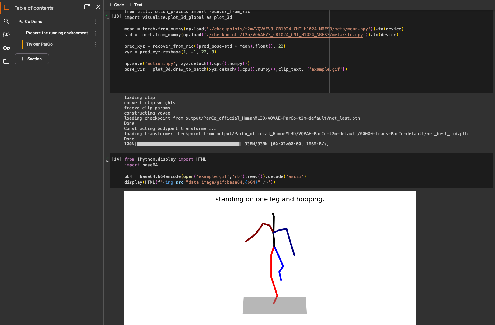
</p>

### 1.2. 本地快速推理

安装完成后，你可以直接使用你自己的文本输入生成动作（.gif格式），如下所示：

```
CUDA_VISIBLE_DEVICES=0 python visualize/infer_motion_npy.py \
--eval-exp-dir output/00001-t2m/VQVAE-ParCo-t2m-default/00000-Trans-ParCo-default \
--select-ckpt fid \
--infer-mode userinput \
--input-text 'an idol trainee is dancing like a basketball dribbling.' \
--skip-path-check
```
生成的动作可视化样本被保存为`output/visualize/XXXXX-userinput/skeleton_viz.gif`。

<p align="center">
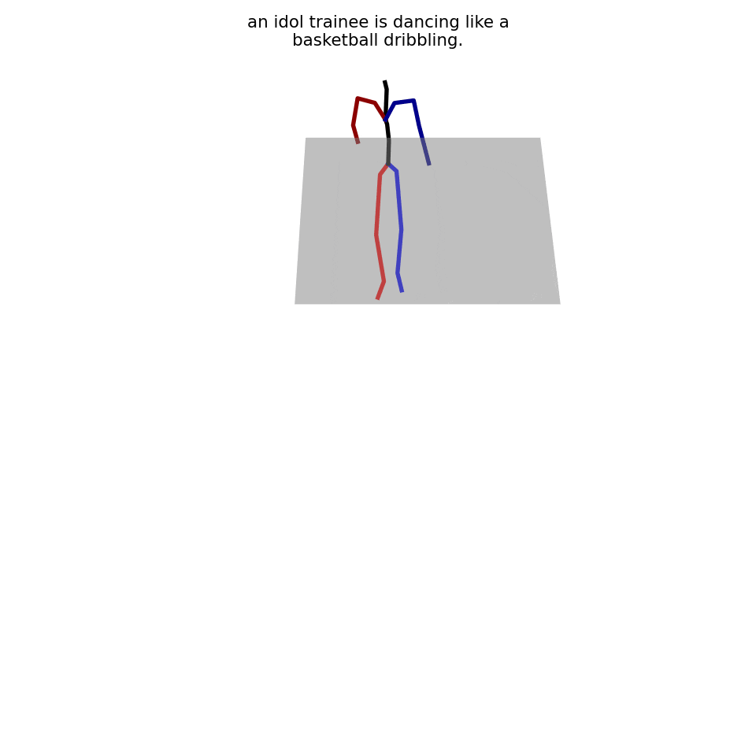
</p>

## 2. 安装

### 2.1. 环境

我们的模型在单个A100-40G GPU上进行了训练和测试，软件环境为：Python 3.7.11、PyTorch 1.10.1、CUDA 11.3.1、cuDNN 8.2.0、Ubuntu 20.04。

- CUDA & cuDNN (cuDNN可能不是必需的)

    CUDA和cuDNN应该首先安装。我们使用以下版本：
    `CUDA: 11.3.1`和`cuDNN: 8.2.0`。

  - 安装CUDA 11.3:
    1. 从[这里](https://developer.nvidia.com/cuda-11-3-1-download-archive)下载
       (我们建议选择安装器类型为`runfile (local)`)。
    1. 使用官方网站提供的脚本安装runfile。
    1. 在运行我们的代码之前，检查你的CUDA环境是否已链接到CUDA 11.3(运行`nvcc --version`来检查)。
    如果版本不是11.3，你需要通过`export PATH=/usr/local/cuda-11.3/bin:$PATH`将CUDA路径添加到你的环境中，然后再次检查版本。
    
  - 安装cuDNN 8.2.0:
    1. 从[这里](https://developer.nvidia.com/rdp/cudnn-archive)下载(根据你的系统选择`8.2.0 for CUDA 11.X`和`cuDNN Library for Linux/Windows`)
    1. 根据[指导](https://docs.nvidia.com/deeplearning/cudnn/archives/cudnn-820/install-guide/index.html#installlinux-tar)下载cuDNN。
    请参考第`2.3. 数据集`，因为我们在之前的阶段已经下载了tar文件。


- Conda环境
  
  你需要遵循下面的脚本来避免潜在的包冲突。否则，可能无法正确安装PyTorch或安装某些包时失败。

  - 创建conda环境
    ```
    conda create -n ParCo blas=1.0 bzip2=1.0.8 ca-certificates=2021.7.5 certifi=2021.5.30 freetype=2.10.4 gmp=6.2.1 gnutls=3.6.15 intel-openmp=2021.3.0 jpeg=9b lame=3.100 lcms2=2.12 ld_impl_linux-64=2.35.1 libffi=3.3 libgcc-ng=9.3.0 libgomp=9.3.0 libiconv=1.15 libidn2=2.3.2 libpng=1.6.37 libstdcxx-ng=9.3.0 libtasn1=4.16.0 libtiff=4.2.0 libunistring=0.9.10 libuv=1.40.0 libwebp-base=1.2.0 lz4-c=1.9.3 mkl=2021.3.0 mkl-service=2.4.0 mkl_fft=1.3.0 mkl_random=1.2.2 ncurses=6.2 nettle=3.7.3 ninja=1.10.2 numpy=1.20.3 numpy-base=1.20.3 olefile=0.46 openh264=2.1.0 openjpeg=2.3.0 openssl=1.1.1k pillow=8.3.1 pip=21.0.1 readline=8.1 setuptools=52.0.0 six=1.16.0 sqlite=3.36.0 tk=8.6.10 typing_extensions=3.10.0.0 wheel=0.37.0 xz=5.2.5 zlib=1.2.11 zstd=1.4.9 python=3.7
    ```
    ```
    conda activate ParCo
    ```
  - 安装必要的包(执行以下所有脚本)
    ```
    conda install ffmpeg=4.3 -c pytorch
    conda install pytorch==1.10.1 torchvision==0.11.2 torchaudio==0.10.1 cudatoolkit=11.3 -c pytorch -c conda-forge
    ```
    ``` 
    pip install absl-py==0.13.0 backcall==0.2.0 cachetools==4.2.2 charset-normalizer==2.0.4 chumpy==0.70 cycler==0.10.0 decorator==5.0.9 google-auth==1.35.0 google-auth-oauthlib==0.4.5 grpcio==1.39.0 idna==3.2 imageio==2.9.0 ipdb==0.13.9 ipython==7.26.0 ipython-genutils==0.2.0 jedi==0.18.0 joblib==1.0.1 kiwisolver==1.3.1 markdown==3.3.4 matplotlib==3.4.3 matplotlib-inline==0.1.2 oauthlib==3.1.1 pandas==1.3.2 parso==0.8.2 pexpect==4.8.0 pickleshare==0.7.5 prompt-toolkit==3.0.20 protobuf==3.17.3 ptyprocess==0.7.0 pyasn1==0.4.8 pyasn1-modules==0.2.8 pygments==2.10.0 pyparsing==2.4.7 python-dateutil==2.8.2 pytz==2021.1 pyyaml==5.4.1 requests==2.26.0 requests-oauthlib==1.3.0 rsa==4.7.2 scikit-learn==0.24.2 scipy==1.7.1 sklearn==0.0 smplx==0.1.28 tensorboard==2.6.0 tensorboard-data-server==0.6.1 tensorboard-plugin-wit==1.8.0 threadpoolctl==2.2.0 toml==0.10.2 tqdm==4.62.2 traitlets==5.0.5 urllib3==1.26.6 wcwidth==0.2.5 werkzeug==2.0.1 git+https://github.com/openai/CLIP.git git+https://github.com/nghorbani/human_body_prior gdown moviepy
    ```
    ```
    pip install imageio-ffmpeg
    pip install importlib-metadata==4.13.0
    ```

  - 安装渲染动作所需的包（可选）
    ```
    bash dataset/prepare/download_smpl.sh
    conda install -c menpo osmesa
    conda install h5py
    conda install -c conda-forge shapely pyrender trimesh==3.22.5 mapbox_earcut
    ```
    如果你在使用代理访问Google Drive，请使用`bash dataset/prepare/use_proxy/download_smpl.sh`进行下载。
    脚本中默认的代理端口设置为`1087`，你可以将其修改为你自己的代理端口。

### 2.2. 特征提取器

我们使用[T2M](https://github.com/EricGuo5513/text-to-motion)提供的提取器进行评估。
请下载提取器和glove词向量器。注意，系统中应预先安装了'zip'，如果没有，请运行`sudo apt-get install zip`来安装zip。

```
bash dataset/prepare/download_glove.sh
bash dataset/prepare/download_extractor.sh
```
如果你在使用代理访问Google Drive，请使用下面的脚本进行下载。脚本中默认的代理端口设置为`1087`，你可以修改脚本以设置你自己的代理端口。
```
bash dataset/prepare/use_proxy/download_glove.sh
bash dataset/prepare/use_proxy/download_extractor.sh
```

### 2.3. 数据集

我们的项目使用了两个3D人体动作语言数据集，[HumanML3D](https://github.com/EricGuo5513/HumanML3D)和[KIT-ML](https://arxiv.org/pdf/1607.03827.pdf)。
你可以在[这里](https://github.com/EricGuo5513/HumanML3D).找到这两个数据集的准备和获取信息。

你也可以直接下载我们处理过的这些数据集：[[Google Drive]](https://drive.google.com/drive/folders/1BuxQWAWtxwauD7AqF0TIpWjoqujYKq8v?usp=share_link).

文件目录应该如下所示：
```
./dataset/HumanML3D/
├── new_joint_vecs/
├── texts/
├── Mean.npy # 与[HumanML3D](https://github.com/EricGuo5513/HumanML3D)中相同
├── Std.npy # 与[HumanML3D](https://github.com/EricGuo5513/HumanML3D)中相同
├── train.txt
├── val.txt
├── test.txt
├── train_val.txt
└── all.txt
```

## 3. 训练

我们项目的实验目录结构是：
```
./output  (arg.out_dir)
 ├── 00000-DATASET  (exp_number + dataset_name)
 │   └── VQVAE-EXP_NAME-DESC  (VQVAE + args.exp_name + desc)
 │       ├── events.out.XXX
 │       ├── net_best_XXX.pth
 │       ...
 │       ├── run.log
 │       ├── test_vqvae
 │       │   ├── ...
 │       │   ...
 │       ├── 0000-Trans-EXP_NAME-DESC  (stage2_exp_number + Trans + args.exp_name + desc)
 │       │   ├── quantized_dataset  (使用VQVAE量化的动作)
 │       │   ├── events.out.XXX
 │       │   ├── net_best_XXX.pth
 │       │   ...
 │       │   ├── run.log
 │       │   └── test_trans
 │       │       ├── ...
 │       │       ...
 │       ├── 0001-Trans-EXP_NAME-DESC
 │       ...
 ├── 00001-DATASET  (exp_number + dataset_name)
 ...
```


### 3.1. VQ-VAE

对于KIT数据集，设置`--dataname kit`.

```bash
CUDA_VISIBLE_DEVICES=0 python train_ParCo_vq.py \
--out-dir output \
--exp-name ParCo \
--dataname t2m \
--batch-size 256 \
--lr 2e-4 \
--total-iter 300000 \
--lr-scheduler 200000 \
--vqvae-cfg default \
--down-t 2 \
--depth 3 \
--dilation-growth-rate 3 \
--vq-act relu \
--quantizer ema_reset \
--loss-vel 0.5 \
--recons-loss l1_smooth
```

### 3.2. Part-Coordinated Transformer

记得将`--vqvae-train-dir`设置为你训练的VQ-VAE对应的目录。

对于KIT数据集，设置`--dataname kit`.

```bash
CUDA_VISIBLE_DEVICES=0 python train_ParCo_trans.py \
--vqvae-train-dir output/00000-t2m-ParCo/VQVAE-ParCo-t2m-default/ \
--select-vqvae-ckpt last \
--exp-name ParCo \
--pkeep 0.4 \
--batch-size 128 \
--trans-cfg default \
--fuse-ver V1_3 \
--alpha 1.0 \
--num-layers 14 \
--embed-dim-gpt 1024 \
--nb-code 512 \
--n-head-gpt 16 \
--block-size 51 \
--ff-rate 4 \
--drop-out-rate 0.1 \
--total-iter 300000 \
--eval-iter 10000 \
--lr-scheduler 150000 \
--lr 0.0001 \
--dataname t2m \
--down-t 2 \
--depth 3 \
--quantizer ema_reset \
--dilation-growth-rate 3 \
--vq-act relu
```


## 4. 评估
### 4.1. VQ-VAE

记得将`--vqvae-train-dir`设定为你想要评估的VQ-VAE.
```bash
CUDA_VISIBLE_DEVICES=0 python eval_ParCo_vq.py --vqvae-train-dir output/00000-t2m-ParCo/VQVAE-ParCo-t2m-default/ --select-vqvae-ckpt last
```

### 4.2. Part-Coordinated Transformer

对于在KIT-ML数据集上的评估，请设置`--select-ckpt last`.
如果你想评估多模态（需要很长时间），只需删除`--skip-mmod`.

记得将`--eval-exp-dir` 设置为你训练的ParCo的目录。
```bash
CUDA_VISIBLE_DEVICES=0 python eval_ParCo_trans.py \
--eval-exp-dir output/00000-t2m-ParCo/VQVAE-ParCo-t2m-default/00000-Trans-ParCo-default \
--select-ckpt fid \
--skip-mmod
```


## 5. 预训练模型


我们提供了预训练的模型，可以在[[Google Drive]](https://drive.google.com/drive/folders/1MNiA76kChAPVZyhiwHFpOcoqz1mcZIhL?usp=share_link)中找到。
解压缩.zip文件并将它们放在`output`文件夹下以供评估。

由于我们重命名了预训练模型的目录，请在评估我们的Part-Coordinated transformer时记得设置`--skip-path-check`。例如：

```bash
CUDA_VISIBLE_DEVICES=0 python eval_ParCo_trans.py \
--eval-exp-dir output/ParCo_official_HumanML3D/VQVAE-ParCo-t2m-default/00000-Trans-ParCo-default \
--select-ckpt fid \
--skip-mmod \
--skip-path-check
```

## 6. 上半身和下半身分区
我们的ParCo采用6部分分区策略。如果您想研究上半身和下半身分区的ParCo，请运行下面的脚本。
<details>
<summary>
详情
</summary>

- 训练(对于KIT数据集，设置`--dataname kit`):

  - VQ-VAE (上&下)
    ```
    CUDA_VISIBLE_DEVICES=0 python utils/ParCo_uplow/train_ParCo_vq_uplow.py \
    --out-dir output \
    --exp-name ParCo \
    --dataname t2m \
    --batch-size 256 \
    --lr 2e-4 \
    --total-iter 300000 \
    --lr-scheduler 200000 \
    --vqvae-cfg default \
    --down-t 2 \
    --depth 3 \
    --dilation-growth-rate 3 \
    --vq-act relu \
    --quantizer ema_reset \
    --loss-vel 0.5 \
    --recons-loss l1_smooth
    ```
    
  - Part-Coordinated Transformer (上&下)

    记得将`--vqvae-train-dir`设置为你训练的VQ-VAE对应的目录。 

    ```
    CUDA_VISIBLE_DEVICES=0 python utils/ParCo_uplow/train_ParCo_trans_uplow.py \
    --vqvae-train-dir output/00000-t2m-ParCo-UpLow/VQVAE-ParCo-t2m-default/ \
    --select-vqvae-ckpt last \
    --exp-name ParCo \
    --pkeep 0.4 \
    --batch-size 128 \
    --trans-cfg default \
    --fuse-ver V1_3 \
    --alpha 1.0 \
    --num-layers 14 \
    --embed-dim-gpt 1024 \
    --nb-code 512 \
    --n-head-gpt 16 \
    --block-size 51 \
    --ff-rate 4 \
    --drop-out-rate 0.1 \
    --total-iter 300000 \
    --eval-iter 10000 \
    --lr-scheduler 150000 \
    --lr 0.0001 \
    --dataname t2m \
    --down-t 2 \
    --depth 3 \
    --quantizer ema_reset \
    --dilation-growth-rate 3 \
    --vq-act relu
    ```
    
- 评估:

  类似于6部分的脚本，只需将运行脚本更改为`utils/ParCo_uplow/`目录下的脚本。例如，要评估Part-Coordinated Transformer（上&下），脚本应该是:

  ```
  CUDA_VISIBLE_DEVICES=0 python utils/ParCo_uplow/eval_ParCo_trans_uplow.py \
  --eval-exp-dir output/00000-t2m-ParCo-UpLow/VQVAE-ParCo-t2m-default/00000-Trans-ParCo-default \
  --select-ckpt fid \
  --skip-mmod
  ```
  记得设置`--eval-exp-dir`到训练模型的目录。
  
</details>


## 7. 可视化动作

渲染SMPL网格:

- 选项1：使用我们提供的工具（部分来源于[T2M-GPT](https://github.com/Mael-zys/T2M-GPT)）:
  1. 生成以`.npy`格式保存的动作:
  
     生成的结果将被保存在`output/visualize/`。
     
     选择您喜欢的模式:
     - 由用户输入文本:
       ```
       CUDA_VISIBLE_DEVICES=0 python visualize/infer_motion_npy.py \
       --eval-exp-dir output/ParCo_official_HumanML3D/VQVAE-ParCo-t2m-default/00000-Trans-ParCo-default \
       --select-ckpt fid \
       --infer-mode userinput \
       --input-text 'an idol trainee is dancing like a basketball dribbling.' \
       --skip-path-check
       ```
     - 测试集作为输入:
       ```
       CUDA_VISIBLE_DEVICES=0 python visualize/infer_motion_npy.py \
       --eval-exp-dir output/ParCo_official_HumanML3D/VQVAE-ParCo-t2m-default/00000-Trans-ParCo-default \
       --select-ckpt fid \
       --infer-mode testset \
       --skip-path-check
       ```
  1. 渲染`.npy`动作文件:
  
     记得安装渲染所需的包（在2.1. 环境中）。
     将`--filedir`设置为您自己的动作文件目录。
     
     渲染的结果将保存在与您的动作文件相同的目录下的`rendered_motion`文件夹中。
     例如:
  
     ```
     CUDA_VISIBLE_DEVICES=0 python visualize/render_final.py --filedir output/visualize/00000-userinput/motion.npy 
     ```
     您将得到一个渲染的`.gif`动作。例如:
     <p align="center">
       
     </p>
  

- 选项2（推荐）：参考[MLD](https://github.com/chenfengye/motion-latent-diffusion?tab=readme-ov-file).


## TODO
- [x] 添加Demo
- [x] 渲染动作的可视化教程
- [x] README_zh.md


## 致谢

我们感谢：
- 公开代码: 
[T2M-GPT](https://github.com/Mael-zys/T2M-GPT), 
[MLD](https://github.com/chenfengye/motion-latent-diffusion?tab=readme-ov-file),
[MotionDiffuse](https://github.com/mingyuan-zhang/MotionDiffuse), 
[T2M](https://github.com/EricGuo5513/text-to-motion),
[TM2T](https://github.com/EricGuo5513/TM2T), 
[MDM](https://github.com/GuyTevet/motion-diffusion-model),
等。
- 公开数据集:[HumanML3D](https://github.com/EricGuo5513/HumanML3D)和[KIT-ML](https://arxiv.org/pdf/1607.03827.pdf)。

来自文本到动作社区的其他优秀公开代码:
[ReMoDiffuse](https://github.com/mingyuan-zhang/ReMoDiffuse), [AttT2M](https://github.com/ZcyMonkey/AttT2M)等。


